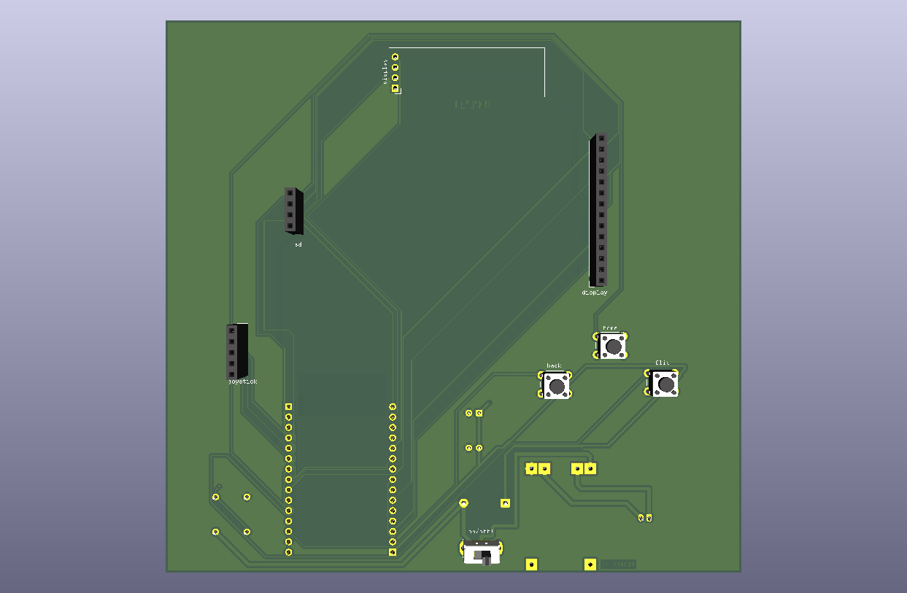

this summer i found myself forced to play chess online with my friends who were interning in different cities

staring at my computer screen got kind of old, so i decided to stare at a 320x240 LCD ILI9341 instead! 

chesp32s lets me play with my friends whenever, wherever - close or far :) 



(the second i assemble this trust and believe the image will be here)


## hardware specs for nerds

* **brain:** ESP32 Dual-Core (Xtensa LX6) @ 240MHz
* **firmware:** C++ / PlatformIO
* **EDA:** KiCad (Schematic + custom footprints + 2-layer PCB)
* **fab:** JLCPCB (new/)
* **board display:** 2.8" ILI9341 320x240 Color TFT over dedicated hardware SPI
* **HUD display:** 0.96" SSD1306 128x64 OLED over I2C
* **inputs:** 2-axis analog joystick (ADC) + push-to-click, plus tactile action switches (`back`, `home`, `flip`)
* **power system:** single-cell LiPo (3.7V nominal, 4.2V max) with onboard USB-C charging via TP4056
* **telemetry:** passive resistor divider to ADC for real-time voltage monitoring & fuel gauging
* **protection:** reverse-polarity / backfeed isolation diode + decoupling filter capacitor bank

## (ﾉ◕ヮ◕)ﾉ*:･ﾟ✧

```text
       [ LiPo Battery (3.7V) ] ──> [ Voltage Divider ] ──> [ ADC Pin ]
                 │
                 ▼
[ USB-C ] ──> [ TP4056 / 3.3V LDO ]
                 │
                 ▼
          [ ESP32 Core ]
         /      |       \
   (SPI)        (I2C)    (Analog/GPIO)
     │            │             │
[ ILI9341 ]  [ SSD1306 ]   [ Joystick & Buttons ]
(Chessboard)    (HUD)        (Move Navigation)
```

## firmwaresque: how do i play?
### game modes

* **pass n play** for when only one person's board is charged: HUD tracks whos turn it is, move history, and board flip can be toggled manually via button
* **solo vs. engine (minimax)** for when you have no friends: the lightweight, onboard chess engine running directly on the ESP32 uses alpha-beta pruning / minimax evaluation to calculate moves locally without needing an internet connection
* **board-to-board (ESP-NOW)** for when both boards are charged: direct wireless peer-to-peer between two `chesp32s` boards over raw ESP-NOW packets. no Wi-Fi router or pairing menus required. just pinging moves directly over 2.4GHz
* **lichess online** for when you're feeling frisky! : connects over Wi-Fi using the Lichess Board API. game events stream over HTTPS/SSE in the background, and moves are dispatched via REST calls so you can play rated matches against friends or randoms from your pocket console

% ### navigation 101 %

## struggles (that i am proud to have overcome) 

* **bus architecture:** driving two separate screens from one ESP32 meant balancing speed and pin budget. squeezing both displays onto one bus was a recipe for sluggish rendering, so the primary ILI9341 runs on dedicated hardware SPI for smooth piece updates, while the secondary status HUD sits on I2C to conserve GPIOs.
* **the LDO brownout incident:** early prototyping was plagued by random board resets because the devboard's stock onboard linear regulator had an absurdly high dropout voltage. the second the LiPo drifted away from a fresh 4.2V charge, the 3.3V power rail would plummet toward ~2.5V, well below the ESP32's brownout detection threshold. i had to audit the power path, factor in quiescent/dropout specs, and implement proper decoupling passives alongside a protection diode to keep the supply rail clean and prevent USB backfeed.
* **battery sensing without frying the ADC:** on that note: i needed real-time fuel-gauge tracking for the LiPo. sitting at ~4.2V when charged (well above the ESP32’s 3.3V pin rating), i calculated and routed an analog resistor voltage divider to step the voltage down safely while minimizing parasitic current draw when idle.
* **datasheets... :** kicad symbols rarely match cheap breakout boards or niche components. as a result, i had to manually measure hardware components, verify mechanical drill tolerances against datasheets, and iteratively debug clearances through JLCDFM rule checks to ensure zero spacing violations before fab.


